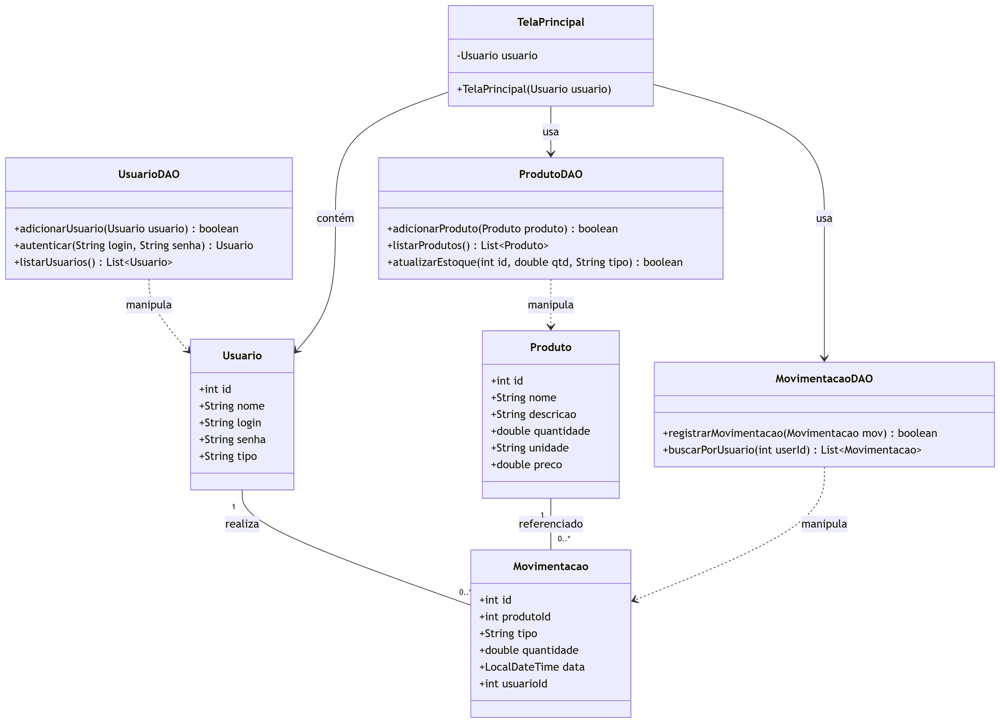

  

# Sistema de Controle de Estoque para Lanchonete 🍔☕

<p align="left">
  <a href="https://www.oracle.com/java/technologies/javase/jdk11-archive-downloads.html">
    
  </a>
  <a href="https://docs.oracle.com/javase/tutorial/uiswing/">
    
  </a>
  <a href="https://www.mysql.com/">
    
  </a>
  <a href="https://dev.mysql.com/downloads/connector/j/">
    
  </a>
</p>

---

  

## 📌 Visão Geral

  

Sistema completo para gerenciamento de estoque de lanchonete, desenvolvido em Java com interface Swing e persistência em banco de dados MySQL.

  

---

  

## 🛠️ Tecnologias Utilizadas

  

-  **Linguagem**: Java 11

-  **Interface Gráfica**: Java Swing

-  **Banco de Dados**: MySQL 8.0

-  **Controle de Versão**: Git/GitHub

  

---

## 🚀 Funcionalidades Principais

| Módulo                | Descrição                                        |
|-----------------------|--------------------------------------------------|
| 👤 **Autenticação**    | Login com diferentes níveis de acesso            |
| 📦 **Gestão de Produtos** | Cadastro, edição e listagem de produtos       |
| 🔄 **Movimentações**   | Registro de entradas e saídas do estoque         |
| 📊 **Relatórios**      | Visualização de estoque atual e valores          |
| 👥 **Administração**   | Gerenciamento de usuários (apenas admin)         |

---

  


## 🗃️ Estrutura do Projeto

```bash
src/
├── dao/                         # Camada de acesso a dados (DAO)
│   ├── ConexaoBD.java
│   ├── MovimentacaoDAO.java
│   ├── ProdutoDAO.java
│   └── UsuarioDAO.java
├── main/                        # Classe principal
│   └── Main.java
├── model/                       # Modelos de dados (Entidades)
│   ├── Movimentacao.java
│   ├── Produto.java
│   └── Usuario.java
└── view/                        # Camada de interface gráfica (Swing)
    ├── TelaAdminUsuarios.java
    ├── TelaAjuda.java
    ├── TelaCadastroProduto.java
    ├── TelaCadastroUsuario.java
    ├── TelaListagemProdutos.java
    ├── TelaLogin.java
    ├── TelaMovimentacaoEstoque.java
    ├── TelaPrincipal.java
    └── TelaRelatorios.java

.gitignore                       # Arquivo de exclusões do Git
```

---

  

## 🔌 Pré-requisitos e Configuração

  

### Banco de Dados

  

```sql

-- CRIAR BANCO DE DADOS

DROP  DATABASE  IF  EXISTS estoque_lanchonete;

CREATE  DATABASE  estoque_lanchonete;

USE estoque_lanchonete;

  

-- TABELA: produtos

CREATE  TABLE  produtos (

id INT(11) NOT NULL AUTO_INCREMENT,

nome VARCHAR(100) NOT NULL,

descricao TEXT,

quantidade DOUBLE NOT NULL,

unidade VARCHAR(10) NOT NULL,

preco DOUBLE NOT NULL,

data_cadastro TIMESTAMP  NOT NULL  DEFAULT CURRENT_TIMESTAMP,

PRIMARY KEY (id)

) ENGINE=InnoDB DEFAULT CHARSET=latin1;

  

-- TABELA: usuarios (com campo "tipo")

CREATE  TABLE  usuarios (

id INT(11) NOT NULL AUTO_INCREMENT,

nome VARCHAR(100) NOT NULL,

login  VARCHAR(50) NOT NULL  UNIQUE,

senha VARCHAR(255) NOT NULL,

tipo VARCHAR(10) NOT NULL  DEFAULT  'comum',

PRIMARY KEY (id)

) ENGINE=InnoDB DEFAULT CHARSET=latin1;

  

-- TABELA: movimentacoes (referenciando usuarios e produtos)

CREATE  TABLE  movimentacoes (

id INT(11) NOT NULL AUTO_INCREMENT,

produto_id INT(11) NOT NULL,

tipo ENUM('entrada', 'saida') NOT NULL,

quantidade DOUBLE NOT NULL,

data  TIMESTAMP  NOT NULL  DEFAULT CURRENT_TIMESTAMP,

usuario_id INT(11) NOT NULL,

PRIMARY KEY (id),

KEY produto_id (produto_id),

KEY usuario_id (usuario_id),

CONSTRAINT movimentacoes_ibfk_1 FOREIGN KEY (produto_id) REFERENCES produtos (id),

CONSTRAINT movimentacoes_ibfk_2 FOREIGN KEY (usuario_id) REFERENCES usuarios (id)

) ENGINE=InnoDB DEFAULT CHARSET=latin1;

  

-- INSERIR DADOS EXEMPLO EM "produtos"

INSERT INTO produtos (nome, descricao, quantidade, unidade, preco)

VALUES ('Farinha', 'Farinha para massa', 10, 'Kg', 25.00);

  

-- INSERIR USUÁRIO ADMINISTRADOR (senha SHA2: '1234')

INSERT INTO usuarios (nome, login, senha, tipo)

VALUES ('Administrador', 'admin', SHA2('1234', 256), 'admin');

```  

---

  

## 🧩 Integração com JDBC (MySQL Connector/J)

  

Este projeto utiliza **JDBC (Java Database Connectivity)** para conectar-se ao banco de dados MySQL. É necessário baixar e adicionar o driver **MySQL Connector/J** ao classpath da aplicação.

  

### 📦 Passos para configurar:

  

1.  **Baixe o driver JDBC do MySQL:**

👉 [Download MySQL Connector/J](https://dev.mysql.com/downloads/connector/j/)

  

2.  **Adicione o `.jar` ao classpath do projeto:**

  

-  **No Eclipse:**

Clique com o botão direito no projeto → `Properties` → `Java Build Path` → `Add External JARs` → selecione o `.jar` do driver.

  

-  **No NetBeans:**

Vá em `Libraries` → `Add JAR/Folder` → selecione o `.jar` baixado.

  

3.  **Verifique a configuração da conexão em `ConexaoBD.java`:**

  

```java

private  static  final  String  URL = "jdbc:mysql://localhost:3306/estoque_lanchonete";

private  static  final  String  USUARIO = "seu_usuario";

private  static  final  String  SENHA = "sua_senha";

```

  

---

  

## 📊 Diagrama UML

  



  

---

  

## 🖥️ Telas do Sistema

  

### Tela de Login

- Acesso seguro com diferentes níveis de permissão

  

### Gestão de Produtos

- Cadastro completo com nome, descrição, quantidade e preço

  

### Movimentações

- Registro detalhado de entradas e saídas

  

---

  

## 🚧 Melhorias Futuras

  

- Relatório de movimentações por período

- Integração com sistema de vendas

- Dashboard com gráficos de movimentação

- Exportação para Excel/PDF

  

---

  

## 🤝 Como Contribuir

  

1. Faça um fork do projeto

2. Crie uma branch: `git checkout -b feature/nova-feature`

3. Commit suas mudanças: `git commit -m 'Adiciona nova feature'`

4. Push para a branch: `git push origin feature/nova-feature`

5. Abra um Pull Request

  

---

  

## 📄 Licença

  

Este projeto está licenciado sob a licença MIT - veja o arquivo [LICENSE](LICENSE) para mais detalhes.